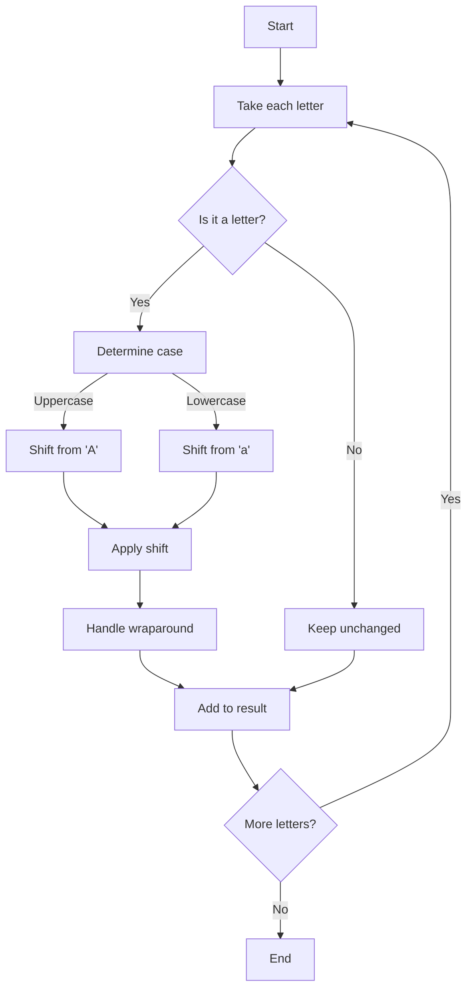

In this tutorial I'll show you how to implement a Caesar cipher in C# using traditional TDD approach.
You can learn two things. How:

1. To code in TDD
2. Caesar cipher works

Let's start from theory

## Caesar cipher

The Caesar cipher is one of the earliest and simplest encryption techniques. It was used by Julius Caesar for his private correspondence.

It works by shifting each letter in the plaintext by a fixed number of positions in the alphabet.

Key features:

- Encrypt text using a specified shift value
- Decrypt text using the same shift value
- Preserve case (uppercase/lowercase) during encryption/decryption
- Handle wraparound at alphabet boundaries (Z → A)
- Preserve non-alphabetic characters (spaces, numbers, punctuation)
- Support for negative shift values

### How Caesar cipher works

I'll show you how encryption and decryption process works in this cipher.

#### Encryption process

1. Take each letter in the plaintext message
2. Shift it forward in the alphabet by the specified amount (the key)
3. Wrap around from Z to A if necessary
4. Non-alphabetic characters remain unchanged

#### Decryption process

1. Take each letter in the encrypted message
2. Shift it backward in the alphabet by the same amount
3. Wrap around from A to Z if necessary
4. Non-alphabetic characters remain unchanged



## Let's code

It's quite simple, isn't it? Good for us, we can implement in quickly!

## Step 1: write initial tests

Start by creating a test project and writing failing tests for the simplest behavior:

1. Create the test project structure:

```bash
dotnet new xunit -o CesarCipherTests
dotnet add CesarCipherTests/CesarCipherTests.csproj reference CesarCipherLib/CesarCipherLib.csproj
```

1. Write the first failing test:

```csharp
using Xunit;
using CesarCipherLib;

namespace CesarCipherTests;

public class CesarCipherTests
{
    [Fact]
    public void When_EncryptingLetterA_WithShiftOf1_ShouldReturnLetterB()
    {
        // Arrange
        var cipher = new CesarCipher();

        // Act
        var result = cipher.Encrypt("A", 1);

        // Assert
        Assert.Equal("B", result);
    }
}
```

Running this test will fail since the implementation doesn't exist yet.

## Step 2: Implement minimal code

Now, implement just enough code to make the test pass:

1. Create the library project and class:

```bash
dotnet new classlib -o CesarCipherLib
```

1. Implement the minimal `CesarCipher` class:

```csharp
namespace CesarCipherLib;

public class CesarCipher
{
    public string Encrypt(string text, int shift)
    {
        if (string.IsNullOrEmpty(text))
            return string.Empty;

        if (text == "A" && shift == 1)
            return "B";

        return text;
    }
}
```

In the very first implementation we need to do something simple to see green tests.

Running the test now should pass.

### Step 3: Add more tests and expand implementation

We can go further by adding more tests cases and improve our implementation.

1. Add the next test for incremental functionality:

```csharp
[Fact]
public void When_EncryptingLetterB_WithShiftOf1_ShouldReturnLetterC()
{
    var cipher = new CesarCipher();
    var result = cipher.Encrypt("B", 1);
    Assert.Equal("C", result);
}
```

1. Refine the implementation to handle this case:

```csharp
public string Encrypt(string text, int shift)
{
    if (string.IsNullOrEmpty(text))
        return string.Empty;

    var result = new System.Text.StringBuilder();

    foreach (char c in text)
    {
        if (char.IsUpper(c))
        {
            char shifted = (char)(((c - 'A' + shift) % 26) + 'A');
            result.Append(shifted);
        }
        else
        {
            result.Append(c);
        }
    }

    return result.ToString();
}
```

Note that this implementation only shifts uppercase letters and leaves all other characters (lowercase letters, numbers, symbols, etc.) unchanged.

1. Add a test for alphabet wraparound:

```csharp
[Fact]
public void When_EncryptingLetterZ_WithShiftOf1_ShouldReturnLetterA()
{
    var cipher = new CesarCipher();
    var result = cipher.Encrypt("Z", 1);
    Assert.Equal("A", result);
}
```

1. Continue with tests for lowercase letters:

```csharp
[Fact]
public void When_EncryptingLowercaseA_WithShiftOf1_ShouldReturnLowercaseB()
{
    var cipher = new CesarCipher();
    var result = cipher.Encrypt("a", 1);
    Assert.Equal("b", result);
}
```

1. Expand the implementation to handle both cases:

```csharp
public string Encrypt(string text, int shift)
{
    if (string.IsNullOrEmpty(text))
        return string.Empty;

    var result = new System.Text.StringBuilder();

    foreach (char inputChar in text)
    {
        if (char.IsLetter(inputChar))
        {
            bool isLower = char.IsLower(inputChar);
            char baseChar = isLower ? 'a' : 'A';

            int normalizedChar = (inputChar - baseChar + shift) % 26;
            if (normalizedChar < 0) normalizedChar += 26;

            result.Append((char)(baseChar + normalizedChar));
        }
        else
        {
            result.Append(inputChar);
        }
    }

    return result.ToString();
}
```

### Step 4: Implement decryption

1. Add a test for decryption functionality:

```csharp
[Fact]
public void When_DecryptingEncryptedText_ShouldReturnOriginalText()
{
    var cipher = new CesarCipher();
    var plainText = "Hello, World!";
    var shift = 5;
    var encryptedText = cipher.Encrypt(plainText, shift);

    var decryptedText = cipher.Decrypt(encryptedText, shift);

    Assert.Equal(plainText, decryptedText);
}
```

1. Implement the `Decrypt` method:

```csharp
public string Decrypt(string text, int shift)
{
    // Decryption is just encryption with the negative shift
    return Encrypt(text, -shift);
}
```

### Step 5: Handle edge cases

1. Add tests for edge cases:

```csharp
[Fact]
public void When_EncryptingLetterA_WithShiftOfMinus1_ShouldReturnLetterZ()
{
    var cipher = new CesarCipher();
    var result = cipher.Encrypt("A", -1);
    Assert.Equal("Z", result);
}

[Fact]
public void When_EncryptingEmptyString_ShouldReturnEmptyString()
{
    var cipher = new CesarCipher();
    var result = cipher.Encrypt("", 1);
    Assert.Equal("", result);
}

[Fact]
public void When_EncryptingWithShiftOf0_ShouldReturnOriginalText()
{
    var cipher = new CesarCipher();
    var text = "HELLO";
    var result = cipher.Encrypt(text, 0);
    Assert.Equal(text, result);
}
```

1. Make sure your implementation handles all these cases correctly.

### Step 6: Refactor and finalize

1. Review your implementation for any potential improvements while keeping all tests passing.

2. Create a simple console application to demonstrate the functionality:

```csharp
using CesarCipherLib;

namespace CesarCipherDemo;

public class Program
{
    public static void Main(string[] args)
    {
        Console.WriteLine("=== Caesar Cipher Demo ===");

        var cipher = new CesarCipher();

        // Example usage
        string message = "HELLO WORLD";
        int shift = 3;
        string encrypted = cipher.Encrypt(message, shift);

        Console.WriteLine($"Original: {message}");
        Console.WriteLine($"Encrypted: {encrypted}");
        Console.WriteLine($"Decrypted: {cipher.Decrypt(encrypted, shift)}");
    }
}
```

### Final verification

1. Run the test suite to verify all functionality:

```bash
dotnet test CesarCipherTests
```

1. Run the sample application to demonstrate the cipher in action:

```bash
dotnet run
```

That's all!

## Summary

By following this TDD approach, we've created a Caesar Cipher implementation that:

- Preserves letter case
- Handles special characters
- Supports negative shifts
- Properly wraps around the alphabet
- Is thoroughly tested against various edge cases

## Links

- [Full implementation](https://github.com/Frodigo/garage/blob/main/sandbox/cybersecurity/cryptography/HistoricalCiphersDemo/Ciphers/Caesar/CaesarCipher.cs)
- [Tests](https://github.com/Frodigo/garage/blob/main/sandbox/cybersecurity/cryptography/HistoricalCiphersDemo/Tests/CaesarCipherTests.cs)
- [Other historical ciphers implementations](https://github.com/Frodigo/garage/tree/main/sandbox/cybersecurity/cryptography/HistoricalCiphersDemo)

---
*Published at: 26/03/2025* #blog #ProgrammingFundamentals #Cybersecurity #CSharp  #CSharp #xUnit #DotNet #Tutorial #ConceptExplanation #Intermediate #AutomatedTesting
