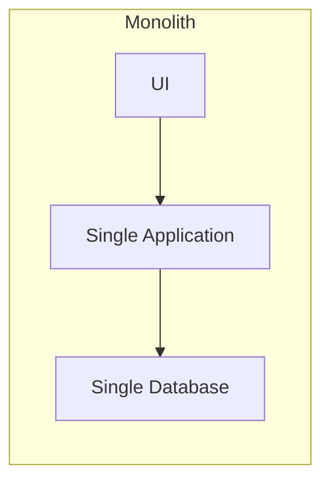
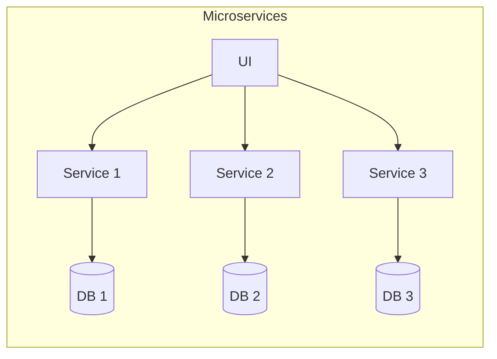
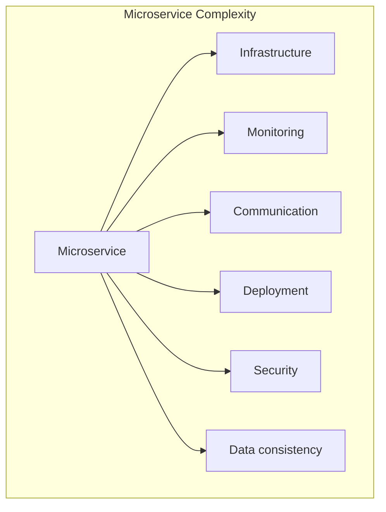
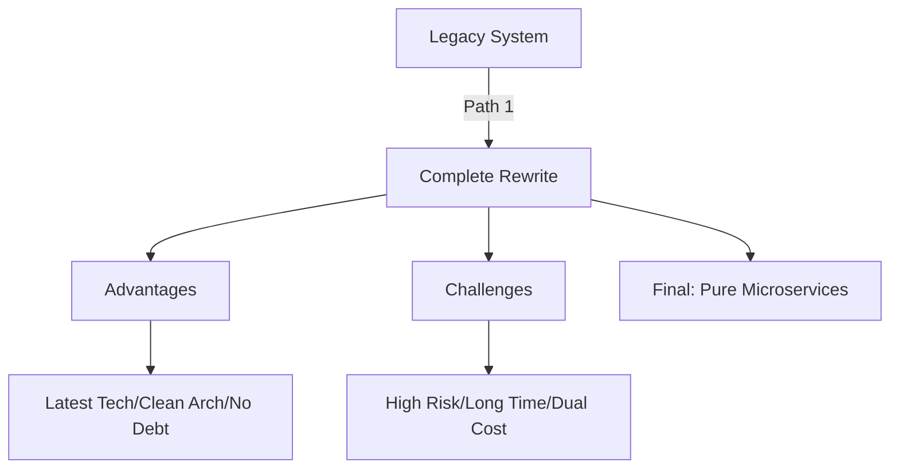
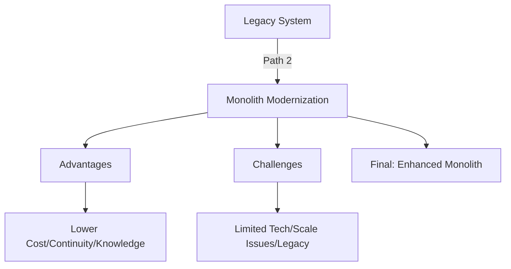
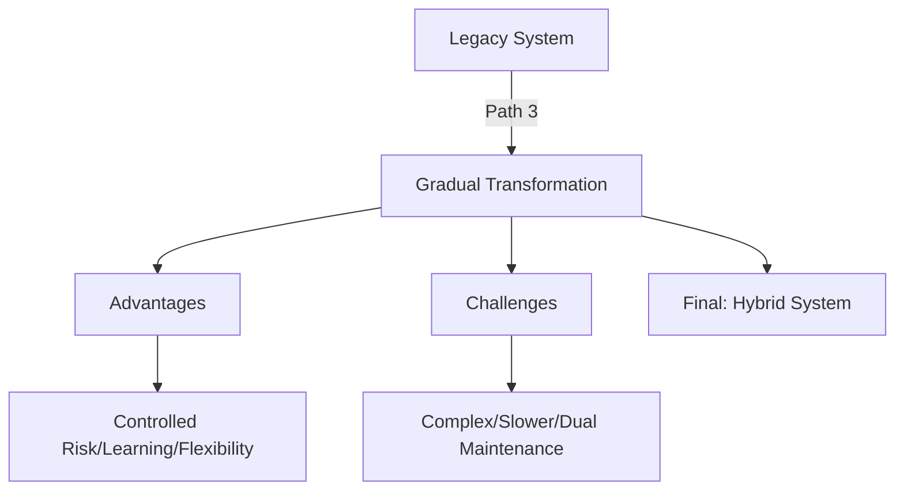
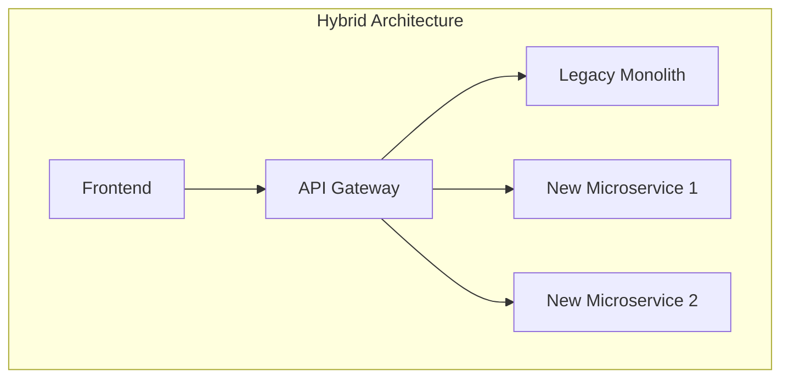

*Last updated: 17/12/2024*

## The Good Old Monolith

I've worked with various system architectures for many years and always wonder why some solutions work well in certain organizations but not in others. A monolith, or traditional application architecture, has much in common with a classic car. Simple engine, minimal electronics, everything is well-known and easy to understand. When a gasoline engine in a classic car won't start, it usually comes down to two reasons:

1. no fuel
2. no electricity/spark

(note: I'm greatly simplifying here, but this isn't the place for in-depth analysis of how engines work)

In a monolith, you have one database, one deployment, one team. It's like a car that any mechanic can diagnose and fix. Debugging is simple - everything is in one place. Database transactions work reliably. Deployment is like taking a walk - simple and predictable.

The problem is that this car, like a monolith, has its limitations. No parking sensors, cameras, conveniences or driving assistance systems. You can add all of this yourself, but it's not simple, and the more you change and add non-standard things, the harder the car becomes to maintain. And it's the same with monoliths. Making changes becomes increasingly difficult. Young programmers complain about outdated practices. Scaling requires more and more resources.

---

## The Microservices Revolution

And here come microservices - like the latest cars where the engine and chassis are wrapped in various systems that can work wonders. Microservices offer a vision of a system composed of independent, small services. But this vision, though tempting, raises legitimate concerns.

---

### 1. Distribution Complexity

It's like going from a stage where fixing a car required a ratchet, screwdriver and hammer to a point where you can't even begin diagnostics without a range of diagnostic tools and specialist knowledge. Each microservice needs its own infrastructure, monitoring, logging. The world becomes more complicated.

### 2. Complex Communication

In monoliths, everything was within reach. Now you need a reliable system for inter-service communication. It's like tons of cables in the newest cars. In microservices, you must decide whether to connect via REST API, gRPC, or perhaps opt for distributed communication (events and messages).

### 3. Data Consistency Challenges

It's like coordinating all driving systems in a modern car to help the driver rather than kill them. When each microservice has its own database, we must ensure information synchronization. A change in one place must be recorded in all necessary places.

---

## The Cost of Transformation

From my personal experience with architectural transformations, I know that each path carries specific costs and risks. While leading a team working on developing a large system that created a platform for e-commerce store owners, I learned that what looks great on paper can be much more complicated in reality.

## Approaches to migration

### 1. Complete System Rewrite

This path reminds me of my colleague's story, who worked at a company where they wanted to rewrite their entire system from scratch. After several months of work and significant investments, the project was... frozen. Why? There's probably no clear answer, but let's look at the pros and cons of this approach:

**Advantages:**

- Ability to use the latest technologies
- Clean code without technical debt
- Architecture tailored to current needs

**Disadvantages:**

- Huge business risk
- Long period without new features
- High costs of parallel development
- Risk of losing business knowledge from the old system

---

### 2. Monolith Modernization

I've heard of several successful cases of monolith modernization. The key was focusing on what really needed improvement, rather than blindly following trends.

**Advantages:**

- Lower risk - system continues to operate
- Lower initial costs
- Possibility of gradual improvements
- Retention of business knowledge

**Disadvantages:**

- Technological limitations remain
- Difficulties with fundamental changes
- Scalability problems
- Challenges in recruiting for older technologies

---

### 3. Gradual Transformation

This approach worked best in my project. We started by extracting several critical functionalities into separate services while maintaining the working monolith as the system's core.

**Advantages:**

- Controlled risk
- Opportunity to learn from small projects
- Business continuity maintained
- Gradual building of team competencies

**Disadvantages:**

- Complexity during transition period
- Slower pace of changes
- Complicated integration of old with new
- Greater infrastructure requirements

With this approach, a hybrid architecture works best in the transitional state, where an API Gateway is placed between the frontend and backend services. The API Gateway is responsible for authentication and routing requests to the appropriate services.

---

## Practical Insights

After months of working with microservices, I've reached several important conclusions:

1. **There are no universal solutions** - architecture must fit the specific organization, its culture, and needs.

2. **People are more important than technology** - the best architecture won't help if the team isn't ready for it.

3. **Evolution is better than revolution** - gradual changes often bring better results than radical transformations.

4. **Business must come first** - architecture should support business goals, not be a goal in itself.

5. You need time to learn – creating your first microservice doesn’t mean you already "know microservices." This is only the beginning of your learning journey; everything is still ahead of you.

---

## Summary

The choice between monolith and microservices, as well as the transformation method, are decisions that will have a long-term impact on any organization. The key is finding balance between technological ambitions and business realities.

Remember that neither monoliths nor microservices are inherently bad - everything depends on context. Sometimes the best solution might be a hybrid of both approaches, where part of the system remains a monolith while critical components operate as microservices.

---

#SoftwareArchitecture #BackendDevelopment #SystemDesign #ConceptExplanation #ArchitectureReview #CaseStudy #Intermediate #Microservices #DataConsistency #SystemIntegration #ArchitecturalTransformation #HybridArchitecture
