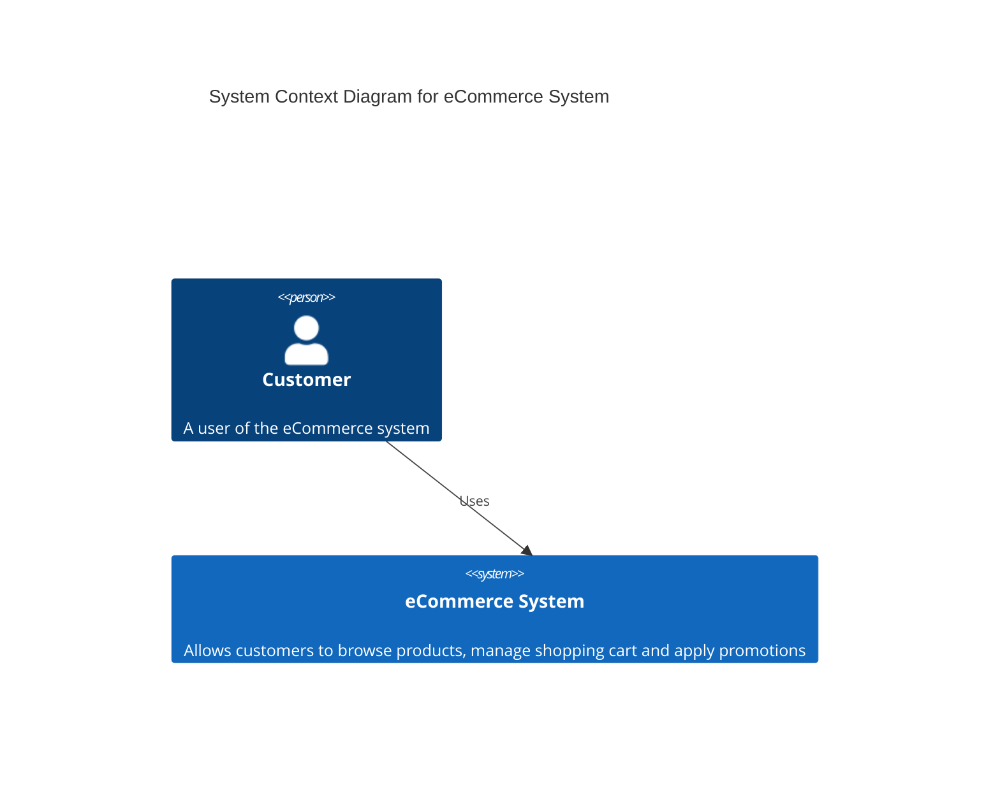
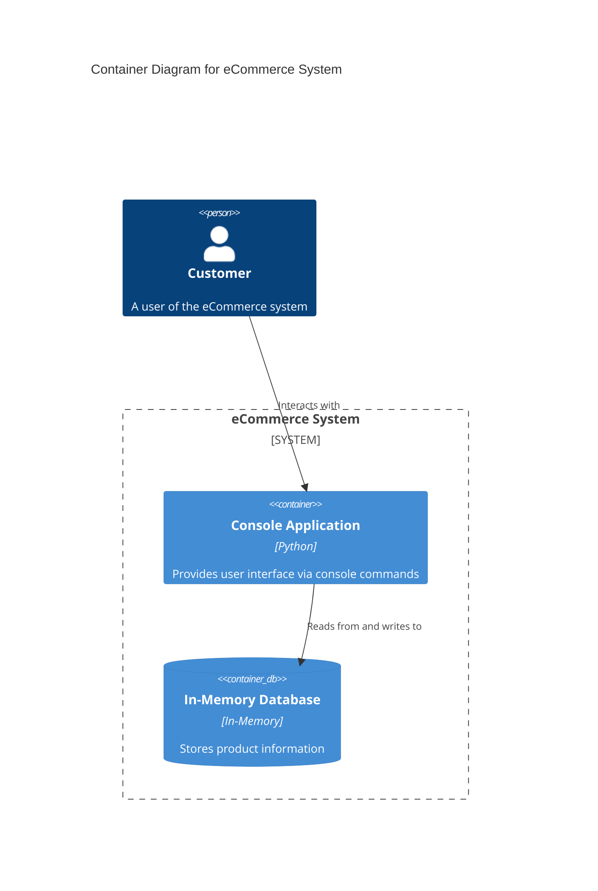
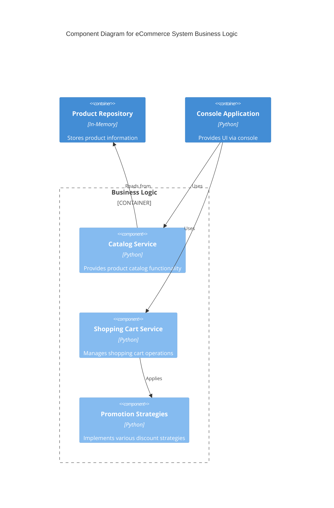
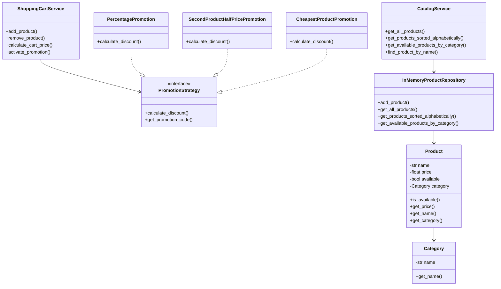

# p911 - Simple eCommerce Backend

A console-based eCommerce application backend written in Python, following Clean Architecture principles.

## Project Overview

This project demonstrates a simple yet complete implementation of an eCommerce system with the following features:

- Product and category management
- Shopping cart functionality
- Various promotion strategies
- Custom exception handling
- Clean Architecture implementation

## Architecture

The application follows Clean Architecture with the following layers:

### Domain Layer

- Core business entities like `Product` and `Category`
- Repository interfaces

### Application Layer

- Business services: `CatalogService`, `ShoppingCartService`
- Custom exceptions for better error handling
- Port interfaces for external dependencies

### Infrastructure Layer

- Repository implementations (e.g., `InMemoryProductRepository`)
- Promotion strategy implementations

### Presentation Layer

- Console-based user interface (`ConsoleApp`)

## Solution Design

The following diagrams represent the system architecture using the C4 Model approach:

### Context Diagram (Level 1)



### Container Diagram (Level 2)



### Component Diagram (Level 3)



### Class Diagram (Level 4)



## Features

### Product Management

- Create and manage products with name, price, and category
- Mark products as available/unavailable
- Sort products alphabetically or by price
- Filter products by category

### Shopping Cart

- Add and remove products from cart
- Calculate cart total price
- Show detailed cart contents

### Promotion System

- Percentage-based discounts
- "Second item half price" promotions
- "Cheapest product discount" promotions
- Flexible promotion strategy pattern

### Exception Handling

- Custom exceptions for different error scenarios:
  - `ProductNotFoundException`: When a product doesn't exist
  - `ProductUnavailableException`: When trying to purchase unavailable products
  - `EmptyCartException`: When operations are performed on empty carts
  - `CategoryNotFoundException`: When a category doesn't exist
  - `InvalidPromotionException`: When promotion parameters are incorrect

## Prerequisites

Before running the application, make sure you have the following installed:

- Python 3.8 or higher

You can check your installation with:

```bash
python --version
```

## Running the Application

To run the application:

```bash
python app.py
```

Or using the module approach:

```bash
python -m app
```

The demonstration will show:

1. Products sorted alphabetically
2. Products filtered by category
3. Shopping cart functionality
4. Different promotion types applied to a cart
5. Exception handling examples
