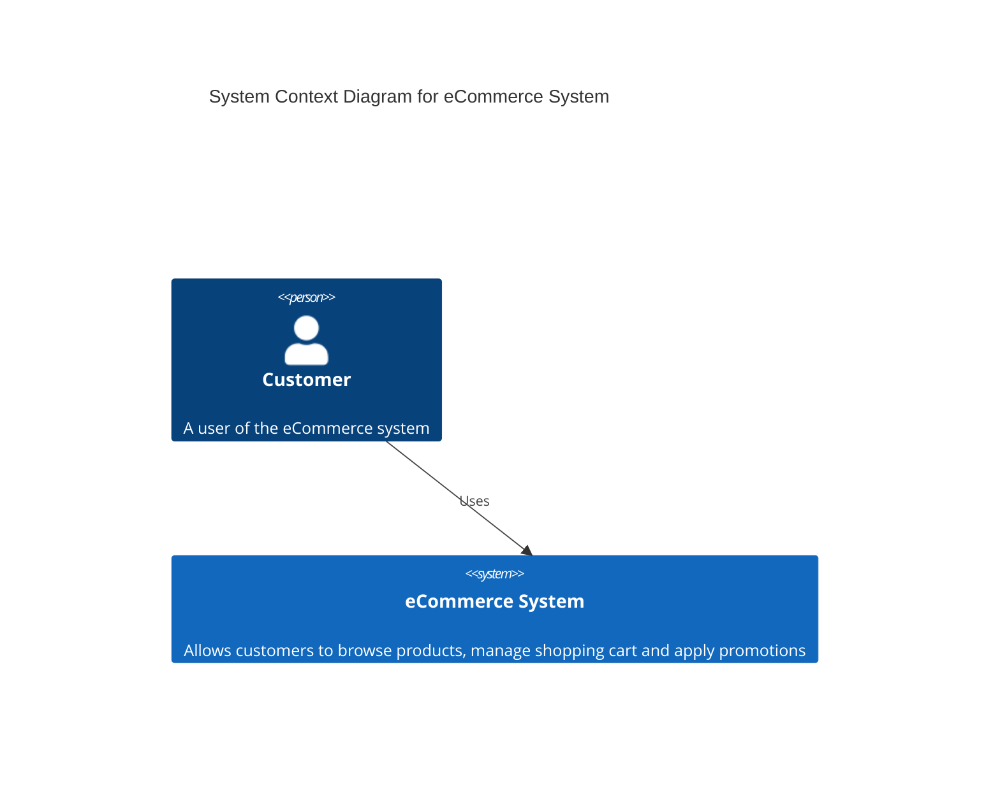
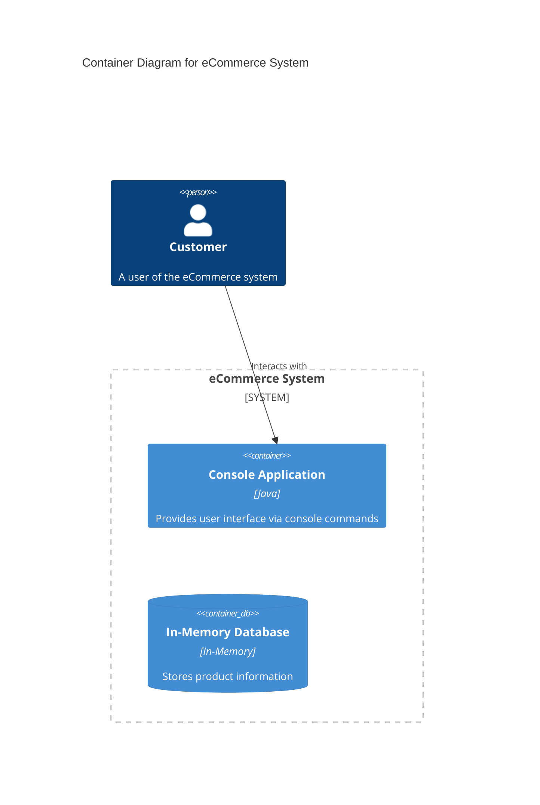
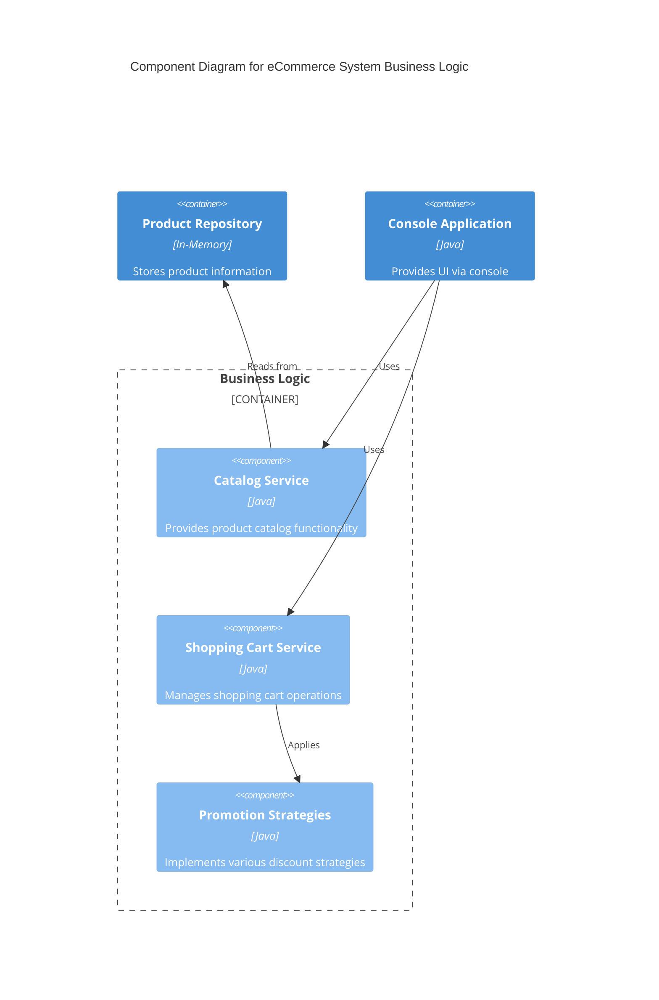
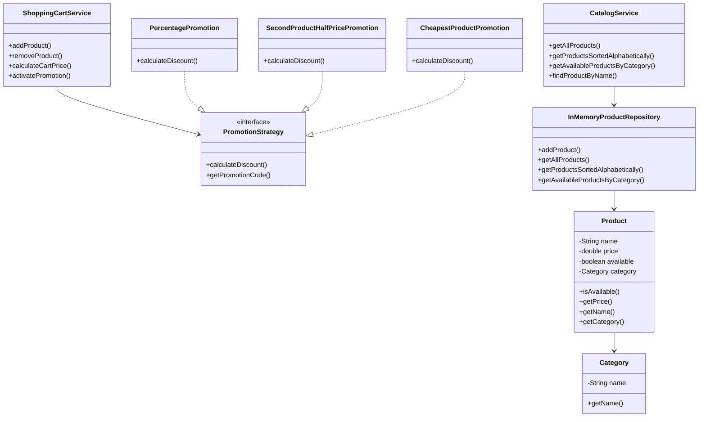

# Simple eCommerce Backend

A console-based eCommerce application backend written in Java, following Clean Architecture principles.

## Project Overview

This project demonstrates a simple yet implementation of an eCommerce system with the following features:

- Product and category management
- Shopping cart functionality
- Various promotion strategies
- Custom exception handling
- Clean Architecture implementation

## Architecture

The application follows Clean Architecture with the following layers:

### Domain Layer

- Core business entities like `Product` and `Category`
- Repository interfaces

### Application Layer

- Business services: `CatalogService`, `ShoppingCartService`
- Custom exceptions for better error handling
- Port interfaces for external dependencies

### Infrastructure Layer

- Repository implementations (e.g., `InMemoryProductRepository`)
- Promotion strategy implementations

### Presentation Layer

- Console-based user interface (`ConsoleApp`)

## Solution Design

The following diagrams represent the system architecture using the C4 Model approach:

### Context Diagram (Level 1)



### Container Diagram (Level 2)



### Component Diagram (Level 3)



### Class Diagram (Level 4)



## Features

### Product Management

- Create and manage products with name, price, and category
- Mark products as available/unavailable
- Sort products alphabetically or by price
- Filter products by category

### Shopping Cart

- Add and remove products from cart
- Calculate cart total price
- Show detailed cart contents

### Promotion System

- Percentage-based discounts
- "Second item half price" promotions
- "Cheapest product discount" promotions
- Flexible promotion strategy pattern

### Exception Handling

- Custom exceptions for different error scenarios:
  - `ProductNotFoundException`: When a product doesn't exist
  - `ProductUnavailableException`: When trying to purchase unavailable products
  - `EmptyCartException`: When operations are performed on empty carts
  - `CategoryNotFoundException`: When a category doesn't exist
  - `InvalidPromotionException`: When promotion parameters are incorrect

## Prerequisites

Before running the application, make sure you have the following installed:

- Java JDK 8 or higher
- Maven 3.6 or higher

You can check your installations with the following commands:

```bash
java -version
mvn -version
```

## Running the Application

To run the application:

```bash
mvn clean package
java -cp target/simple-eccomerce-1.0-SNAPSHOT.jar com.simple.ecommerce.App
```

The demonstration will show:

1. Products sorted alphabetically
2. Products filtered by category
3. Shopping cart functionality
4. Different promotion types applied to a cart
5. Exception handling examples

## Testing

The project extensive unit tests for all components:

```bash
mvn test
```

Unit tests cover:

- Domain entities
- Repository implementations
- Application services
- Promotion strategies
- Exception handling

## Project Structure

```text
src/
├── main/java/com/simple/ecommerce/
│   ├── App.java                              # Main entry point
│   ├── application/                          # Application layer
│   │   ├── exception/                        # Custom exceptions
│   │   ├── port/                            # Interface ports
│   │   └── service/                         # Business services
│   ├── domain/                              # Domain layer
│   │   ├── entity/                          # Domain entities
│   │   └── repository/                      # Repository interfaces
│   ├── infrastructure/                       # Infrastructure layer
│   │   ├── persistence/                     # Repository implementations
│   │   └── promotion/                       # Promotion implementations
│   └── presentation/                         # Presentation layer
│       └── console/                         # Console UI
└── test/                                     # Test cases
```

## Completed Tasks

- ✅ Implemented Product class with attributes and behavior
- ✅ Designed and implemented Product Catalog with filtering and sorting
- ✅ Designed and implemented Shopping Cart with add/remove functionality
- ✅ Added flexible Promotion system with multiple strategies
- ✅ Implemented comprehensive unit tests
- ✅ Followed Clean Architecture principles
- ✅ Added custom exception handling
