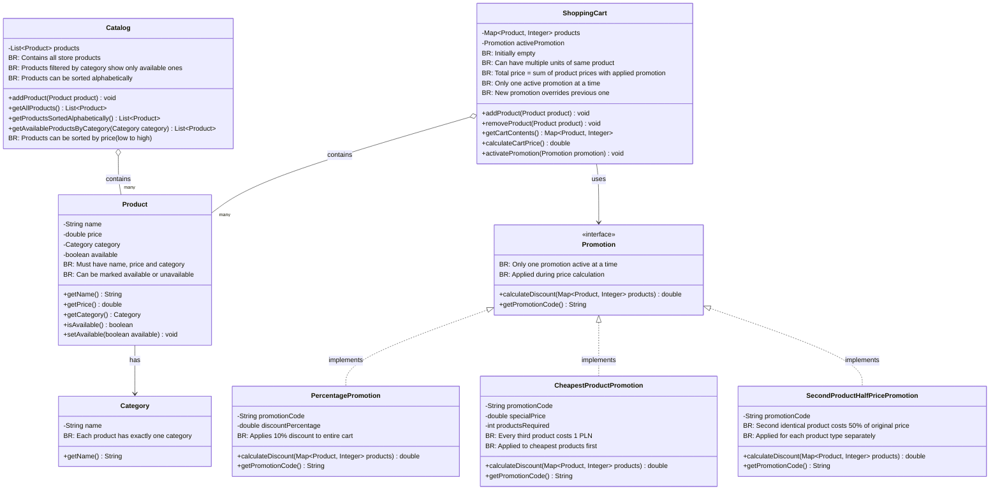

Create a console backend for a simple eCommerce platform enabling customers to shop online.

## Tasks
- Implement Product class
- Design and implement Product Catalog
- Design and implement Shopping Cart
- Add Promotion functionality
- Create a simple class diagram
- Implement unit tests

## Acceptance Criteria

### Product Class
- [ ] Implement Product class with attributes: name, price, category
- [ ] Functionality to mark products as available/unavailable

### Product Catalog
- [ ] Store all products available for purchase
- [ ] Auto-populate catalog with predefined products at application startup
- [ ] Ability to retrieve and display names and prices of all products (alphabetical sorting)
- [ ] Ability to filter products by category (sorting from cheapest, filtering unavailable products)

### Shopping Cart
- [ ] Ability to add products to cart (including multiple instances of the same product)
- [ ] Ability to remove products from cart
- [ ] Display cart contents (product names and quantities)
- [ ] Calculate and display the total price of all products in the cart

### Promotions
- [ ] Add promotions to shopping cart using discount codes
- [ ] Implement "10% off all products in cart" promotion
- [ ] Implement "when buying 3 products, the cheapest one costs 1 PLN" promotion
- [ ] Implement "when buying 2 identical products, the second one is half price" promotion

### Documentation and Testing
- [ ] Create a simple class diagram showing relationships between classes
- [ ] Implement unit tests using JUnit5 and the given-when-then technique

---

## Diagram 

