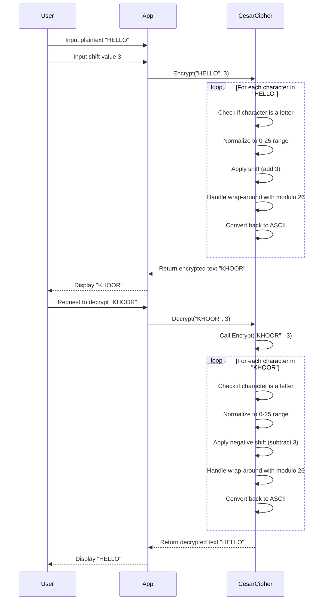

# Caesar Cipher

A simple C# implementation of the Caesar cipher cryptography technique.

## Overview

The Caesar cipher is one of the earliest and simplest encryption techniques.

Julius Caesar used it for his private correspondence.

It works by shifting each letter in the plaintext by a fixed number of positions in the alphabet.

## Features

- Encrypt text using a specified shift value
- Decrypt text using the same shift value
- Preserve case (uppercase/lowercase) during encryption/decryption
- Handle wraparound at alphabet boundaries (Z → A)
- Preserve non-alphabetic characters (spaces, numbers, punctuation)
- Support for negative shift values
- Interactive demo application

## Demo Program

The project includes a demo program that showcases different features of the Caesar cipher:

1. Basic encryption and decryption
2. Working with mixed case and special characters
3. Using negative shift values
4. Interactive mode where you can input your own messages

To run the demo:

```shell
# From the root directory
dotnet run --project CesarCipherApp

# Or from inside the CesarCipherApp directory
cd CesarCipherApp
dotnet run
```

## How Caesar Cipher Works

### Sequence Diagram



### Encryption Process

1. Take each letter in the plaintext message
2. Shift it forward in the alphabet by the specified amount (the key)
3. Wrap around from Z to A if necessary
4. Non-alphabetic characters remain unchanged

Example with a shift of 3:
- A → D
- B → E
- C → F
- ...
- Z → C

### Decryption Process

1. Take each letter in the encrypted message
2. Shift it backward in the alphabet by the same amount
3. Wrap around from A to Z if necessary
4. Non-alphabetic characters remain unchanged

## Implementation Details

The Caesar cipher works by substituting each letter in the plaintext with a letter that is a fixed number of positions down the alphabet. For example, with a shift of 3:

- A becomes D
- B becomes E
- C becomes F
- ...
- Z becomes C (wraparound)

The implementation:

- Shifts only alphabetic characters (A-Z, a-z)
- Preserves the case of each letter
- Leaves non-alphabetic characters unchanged
- Handles shifts that exceed 26 (alphabet size) using modulo arithmetic
- Supports negative shifts (shifting backward in the alphabet)

## Project Structure

- `CesarCipherLib`: Contains the core implementation
- `CesarCipherApp`: Interactive demo application
- `CesarCipherTests`: Comprehensive test suite using xUnit

## Testing

The project follows Test-Driven Development (TDD) principles.

To run the tests:

```shell
dotnet test
```

## Building and Running

### Prerequisites

- .NET 9.0 or later

### Build

```shell
dotnet build
```

### Run

```shell
dotnet run --project CesarCipherApp
```

## License

[MIT License](LICENSE)

## Acknowledgments

- This project was developed as a learning exercise for basic cryptography concepts
- Implementation follows strict TDD (Test-Driven Development) principles:
