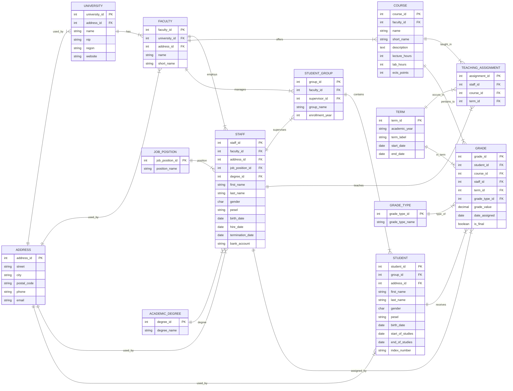

```mermaid
erDiagram
    direction LR
    UNIVERSITY {
        int university_id PK
        int address_id FK
        string name
        string nip
        string regon
        string website
    }

    FACULTY {
        int faculty_id PK
        int university_id FK
        int address_id FK
        string name
        string short_name
    }

    STAFF {
        int staff_id PK
        int faculty_id FK
        int address_id FK
        int job_position_id FK
        int degree_id FK
        string first_name
        string last_name
        char gender
        string pesel
        date birth_date
        date hire_date
        date termination_date
        string bank_account
    }

    STUDENT {
        int student_id PK
        int group_id FK
        int address_id FK
        string first_name
        string last_name
        char gender
        string pesel
        date birth_date
        date start_of_studies
        date end_of_studies
        string index_number
    }

    ADDRESS {
        int address_id PK
        string street
        string city
        string postal_code
        string phone
        string email
    }

    JOB_POSITION {
        int job_position_id PK
        string position_name
    }

    ACADEMIC_DEGREE {
        int degree_id PK
        string degree_name
    }

    TERM {
        int term_id PK
        string academic_year
        string term_label
        date start_date
        date end_date
    }

    COURSE {
        int course_id PK
        int faculty_id FK
        string name
        string short_name
        text description
        int lecture_hours
        int lab_hours
        int ects_points
    }

    TEACHING_ASSIGNMENT {
        int assignment_id PK
        int staff_id FK
        int course_id FK
        int term_id FK
    }

    STUDENT_GROUP {
        int group_id PK
        int faculty_id FK
        int supervisor_id FK
        string group_name
        int enrollment_year
    }

    GRADE_TYPE {
        int grade_type_id PK
        string grade_type_name
    }

    GRADE {
        int grade_id PK
        int student_id FK
        int course_id FK
        int staff_id FK
        int term_id FK
        int grade_type_id FK
        decimal grade_value
        date date_assigned
        boolean is_final
    }

    %% RELATIONSHIPS:

    UNIVERSITY ||--|{ FACULTY : has

    FACULTY ||--|{ STAFF : employs
    FACULTY ||--|{ COURSE : offers
    FACULTY ||--|{ STUDENT_GROUP : manages

    JOB_POSITION ||--|{ STAFF : position
    ACADEMIC_DEGREE ||--|{ STAFF : degree

    STAFF ||--|{ STUDENT_GROUP : supervises

    STUDENT_GROUP ||--|{ STUDENT : contains

    STAFF  ||--|{ TEACHING_ASSIGNMENT : teaches
    COURSE ||--|{ TEACHING_ASSIGNMENT : taught_in
    TERM   ||--|{ TEACHING_ASSIGNMENT : occurs_in

    STUDENT ||--|{ GRADE : receives
    COURSE  ||--|{ GRADE : pertains_to
    STAFF   ||--|{ GRADE : assigned_by
    TERM    ||--|{ GRADE : in_term
    GRADE_TYPE ||--|{ GRADE : type_of

    ADDRESS ||--|{ UNIVERSITY : used_by
    ADDRESS ||--|{ FACULTY    : used_by
    ADDRESS ||--|{ STAFF      : used_by
    ADDRESS ||--|{ STUDENT    : used_by

```
