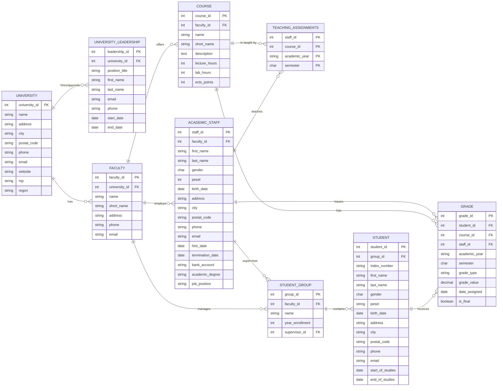

```mermaid
erDiagram
    direction lr
    UNIVERSITY {
        int university_id PK
        string name
        string address
        string city
        string postal_code
        string phone
        string email
        string website
        string nip
        string regon
    }

    UNIVERSITY_LEADERSHIP {
        int leadership_id PK
        int university_id FK
        string position_title
        string first_name
        string last_name
        string email
        string phone
        date start_date
        date end_date
    }

    FACULTY {
        int faculty_id PK
        int university_id FK
        string name
        string short_name
        string address
        string phone
        string email
    }

    ACADEMIC_STAFF {
        int staff_id PK
        int faculty_id FK
        string first_name
        string last_name
        char gender
        int pesel
        date birth_date
        string address
        string city
        string postal_code
        string phone
        string email
        date hire_date
        date termination_date
        string bank_account
        string academic_degree
        string job_position
    }

    COURSE {
        int course_id PK
        int faculty_id FK
        string name
        string short_name
        text description
        int lecture_hours
        int lab_hours
        int ects_points
    }

    TEACHING_ASSIGNMENTS {
        int staff_id PK
        int course_id PK
        string academic_year PK
        char   semester PK
    }

    STUDENT_GROUP {
        int group_id PK
        int faculty_id FK
        string name
        int year_enrollment
        int supervisor_id FK
    }

    STUDENT {
        int student_id PK
        int group_id FK
        string index_number
        string first_name
        string last_name
        char gender
        string pesel
        date birth_date
        string address
        string city
        string postal_code
        string phone
        string email
        date start_of_studies
        date end_of_studies
    }

    GRADE {
        int grade_id PK
        int student_id FK
        int course_id FK
        int staff_id FK
        string academic_year
        char   semester
        string grade_type
        decimal grade_value
        date   date_assigned
        boolean is_final
    }

    %% RELATIONSHIPS

    UNIVERSITY ||--o{ UNIVERSITY_LEADERSHIP : "hires/appoints"
    UNIVERSITY ||--o{ FACULTY : "has"

    FACULTY ||--o{ ACADEMIC_STAFF : "employs"
    FACULTY ||--o{ COURSE        : "offers"
    FACULTY ||--o{ STUDENT_GROUP : "manages"

    ACADEMIC_STAFF ||--o{ TEACHING_ASSIGNMENTS : "teaches"
    COURSE         ||--o{ TEACHING_ASSIGNMENTS : "is taught by"

    ACADEMIC_STAFF ||--o{ STUDENT_GROUP : "supervises"

    STUDENT_GROUP ||--o{ STUDENT : "contains"
    STUDENT       ||--o{ GRADE   : "receives"
    COURSE        ||--o{ GRADE   : "has"
    ACADEMIC_STAFF ||--o{ GRADE : "issues"
```
