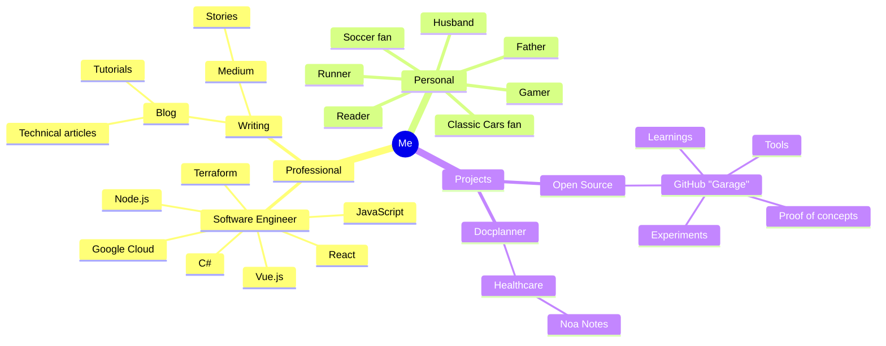

## Who I am

### TLDR: Software Engineer

![[marcin_kwiatkowski2025.jpeg]]

Hi! I am Marcin Kwiatkowski!

I am a **software engineer**.

I **solve problems** with code. I write this code from Poland and I love writing code. Why? Because I feel that I can help to **solve** some big **problems** by just **writing** some **code**.

15 years ago I was roofing houses, and I don't really know what pushed me to engineering. _Anyway, I am not complaining about this._

Currently, in most of my time I am writing code for **Docplanner** and we make health care more human together.

I write this code in **C#** and **Vue.js.** But in the past I wrote code in JavaScript, **PHP**, **React**, **Node.js** and even in **Terraform**.

When I don't write code, I am writing **articles**. You can see them here on **my blog** and on the Medium.

When I don't write code, or articles and I force myself to not using computer, I am probably watching my favorite football (**soccer**) team, playing games or **running**. Typically I do these with my lovely **family**.

When I am running I am thinking about code. This is just my way of relaxing. Cringe? Maybe. Sometimes when I am running I dream about having a **classic car** in my garage.

## My Philosophy

### I ~~am~~ want to be a ~~slow~~free person

#### I don't want to be a racer in a rat race

I enjoy new technologies and I am open to learn new things. The learner skill is my first one from the Gallup Clifton Strengths Assessment.

This is so nice to be able to learn new things fast, but there is a dark side of it. Learning just for learning. I realized that I was jumping from one thing to another.

I wanted to be fast, to be better, to prove something to someone. I was not able to focus on one thing for a long time and enjoy it.

Many times I felt that I felt control and I did things like on autopilot. I learned from this. This is rat race and I don't want to be part of it.

What I am trying to do now is to be a free person.

- do not accept every new thing that is offered to me
- do not believe immediately that XYZ is the thing that will change my life
- do not make decisions based on fear of missing out

Think slower, be free, avoid autopilot. This is my philosophy I am trying to follow.

---

## How I started

My first job was about going to shop to buy a beer for my boss.

### The roofer

I started as a manual worker. In the beginning I was responsible for cleaning the building. Another thing was buying beer for a stuff and move heavy things from one place to another.

After one year I was able to move to the next step and I was able to lay roof tiles.

After a few years I started to be an independent roofer. In addition to roof tiles, I also knew how to install gutters, install roof windows, and do sheet metal work. I became a specialist and even got an assistant.

### The drift

I liked that job because I was able to create something (roofs) and I felt that this is important job. I worked for people who wanted to have a roof over their heads.

Unfortunately, In Poland this job is not well paid and also it was physically difficult. Hot in summer, Cold in winter. Moreover, many employees there were alcoholics. It was not good environment to be.

I started studying computer science and after 3 years I was able to get a job as a frontend developer.

---

## Me After 10 years

What a surprise, after years of learning how to code, I ended up leading a team of developers where I needed such different skills that I have had.

### The full-stack developer

In May 2013 I started to work as a front-end developer at Chop-Chop.org. My job was to convert PSD files to working websites.

After ~ 1 year I joined to a team of Magento developers and started to work on Magento 1.9.x projects and PHP backend.

My next step was to join a Divante - Polish software house where I was able to work with Magento 2.x and create some shops for big Polish companies.

### The tech leader

After 2.5 years I became the technical leader of the Magento frontend team.

In 2020, I joined to a Gorilla Group where I was able to work with international team and develop shops for clients from US market. Also at that time I started contributing to the Magento platform and to the PWA Studio - modern storefront for Magento 2.

In 2021, I was invited to join to the Vuestorefront as a tech leader. I was responsible for leading the team and project.

### The software engineer

After three years of being a tech leader I felt like I don't do what I really want to do. Guess what? I missed coding. I missed writing code. I missed creating something from scratch.

I found a new job at Docplanner where I am able to write code again and create new features I am working with C# and Vue.js.

I like the Docplanner culture and the mission which is about making healthcare more human.

---

## Me now and future me

I want to focus on the engineering and turn into the AI engineer.

### The AI engineer

Recently I experimented with AI and I want to go deeper into this area. Maybe transition from the fullstack developer to the AI engineer is a next turn on my road.

Also I back to school! I started my master's degree in artificial intelligence and machine learning.

Next two years I will be learning a lot of new things which I will share here.

### The educator

After few years of drifting I want to go back to the roots and help others to learn.

Because I like learning and I like writing I want to try to connect these two activities into one and share my knowledge with others.

### The Writer

Writing a book is a big challenge, isn't it? The value of books in the AI area decreases every day.

But I hope books will survive and will be valuable for a long time.

---

## My Services

- Technical Mentoring
- Architecture Consulting
- Career Development Planning
- Technical Content Creation
- Software engineering

[[Contact|Hire me]]

