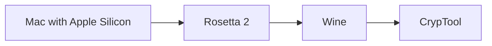
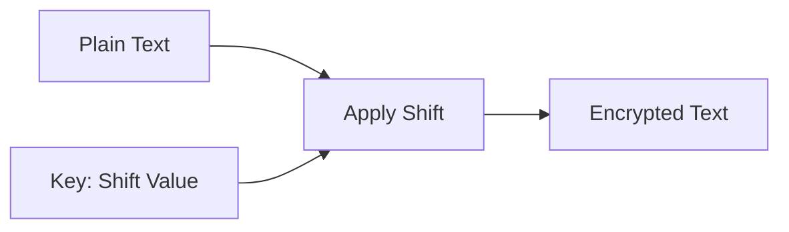
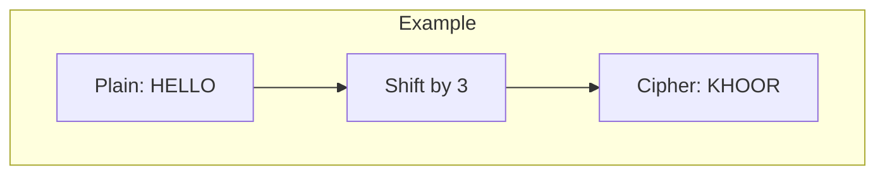
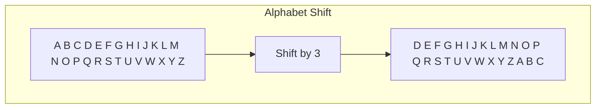
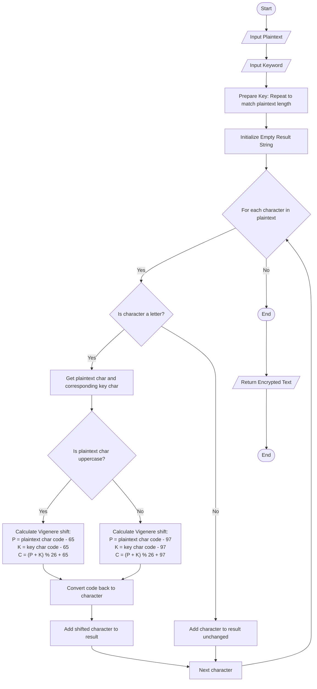
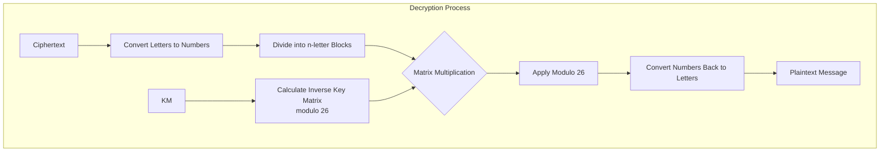

*Last updated: 22/03/2025*

My first task on the [Cybersecurity](/cybersecurity) course at studies was about experimenting with historical cryptography algorithms.

I was sitting in the computer room, it was quite stuffy, and around me were 30 other students. It was the third class of the day. The lecturer came in, who looked like a rather strict gentleman. He explained to us briefly what the course would look like and what the rules were for passing.

The atmosphere began to thicken, and the gentleman promptly moved on to the task. He told us to install `Cryptool1` and do a task related to historical cryptographic algorithms.

Cryptool is a free tool for learning cryptography. Okay, let's install it, but wait, wait.

This tool only works on Windows. :facepalm

I did a quick research and found that I can use run Windows program on Mac using Wine. Let's try I thought:

`brew install --cask wine-stable`

I was pressed for time, because after the exercises we had to write a report.

Unfortunately, internet connection was so poor in that computer room and I was not able to install this tool in 1 hour.

In meantime I used Perplexity to find information about historical crypto algorithms.

I spent the rest of the class reading...

## Few days later

I did back to the topic and again installed the `Wine`, but this time at my home and internet was quite better.

After that I needed to install `Rosetta` - a tool that allows to run apps dedicated for Intel Chips on Apple chips. Oh really?

To run `Cryptool` on my mac I needed to install wine (to run Windows app), but to run `Wine` i needed to install `Rosetta`



I ran Cryptool installer:

`wine SetupCrypTool_1_4_42_pl.exe`

Then I was able to run it (I installed the polish version)


## Algorithms

Ok, so at this moment I can experiment with Cryptool and learn about crypto a bit.

In the scope of task I had: *Cesar*, *Vigenere*, *Hill* and *XOR*. Let's take a closer look at them

### Caesar's [Cipher](/cybersecurity/cipher)

It's one of the oldest and simplest [encryption](/cybersecurity/encryption) algorithm invented (or at least associated with) Julius Caesar.

Cesar used in in around 58 BC. How it worked? It scrambled a message by shifting its letters.
Technically speaking is a [monoalphabetic rotation cipher](/cybersecurity/monoalphabetic-rotation-ciphers). it shifts letters by 3, but there is also a variant called `ROT-13` that shifts letters by 13.

I implemented the Caesar cipher in C# for learning purposes.

Here you can find:

- [repository](https://github.com/Frodigo/garage/tree/main/sandbox/cybersecurity/cryptography/HistoricalCiphersDemo)
- [Caesar cipher code](https://github.com/Frodigo/garage/blob/main/sandbox/cybersecurity/cryptography/HistoricalCiphersDemo/Ciphers/Caesar/CaesarCipher.cs)
- [tests that perfectly shows how it works](https://github.com/Frodigo/garage/blob/main/sandbox/cybersecurity/cryptography/HistoricalCiphersDemo/Tests/CaesarCipherTests.cs)

::right

Before you go to the next cipher, check how the caesar works on diagrams below:







### Vigenère cipher

It's a [polyalphabetic substitution cipher](/cybersecurity/polyalphabetic-substitution-cipher) which uses a keyword to encrypt and decrypt messages.

**How it works?**:

- Each letter of the key specifies a different shift
- Same plaintext letter can encrypt to different [ciphertext](/cybersecurity/ciphertext) letters

1. Algorithm takes two inputs: message(plaintext) and key(password).
2. Algorithm prepare key by repeating it to the message length.
3. Then it intitialize empty result string.
4. Next it iterates on each character in plaintext:
   1. if a char is a letter, gets corresponding char of key
   2. checks is plaintext cha uppercase and calculate Vigenère shift:
      1. for uppercase letter: `(P + K) % 26 +65`
      2. otherwise: `(P + K) % 26 + 97`
   3. if char is not a letter, it's added to the results unchanged
5. When iteration is done, returns ciphertext.

You can find my implementation of this cipher here:

- [Code](https://github.com/Frodigo/garage/blob/main/sandbox/cybersecurity/cryptography/HistoricalCiphersDemo/Ciphers/Vigen%C3%A8re/Vigen%C3%A8reCipher.cs)
- [Tests](https://github.com/Frodigo/garage/blob/main/sandbox/cybersecurity/cryptography/HistoricalCiphersDemo/Tests/Vigen%C3%A8reCipherTests.cs)

Take a look on diagram:



### Hill cipher

It's a polygraphic substitution cipher.

It's a block cipher.

It uses linear algebra and matrix manipulation to encrypt and decrypt messages.

#### How it works

1. Turn letters into numbers
   - `A = 0, B = 1, C = 2... Z = 25`
2. Break your message into small groups
   - If using a `2×2` key, break into groups of 2 letters
3. Use a special key (a math grid of numbers)
   - The key is a square grid of numbers (like 2×2 or 3×3)
4. Do some math magic with your numbers and the key
   - Multiply your letter numbers by the key grid
5. Turn the new numbers back into letters
6. Done

##### Example with "HELP"

1. Convert to numbers:
   - H = 7, E = 4, L = 11, P = 15
2. Split into groups: [7,4] and [11,15]
3. Use this key:
   [3, 2]
   [5, 7]
4. Math magic:
   - For [7,4]:
     [3 2] × [7] = [3×7 + 2×4] = [21+8] = [29] → [3] (after mod 26) (because there are 26 letters in alphabet)
     [5 7] [4] [5×7 + 7×4] [35+28] [63] → [11] (after mod 26)
   - For [11,15]:
     [3 2] × [11] = [3×11 + 2×15] = [33+30] = [63] → [11] (after mod 26)
     [5 7] [15] [5×11 + 7×15] [55+105] [160] → [4] (after mod 26)
5. Convert back to letters:
   - 3 = D, 11 = L, 11 = L, 4 = E
   - Secret message: "DLLE"

To decode it, your need the special inverse key to turn "DLLE" back into "HELP"!

For encryption we used this key (matrix):

[3 2]
[5 7]

To decrypt the message, we need to find the inverse of this matrix.

::right

You can find a basic Hill Cipher implementation here:

- [code](https://github.com/Frodigo/garage/blob/main/sandbox/cybersecurity/cryptography/HistoricalCiphersDemo/Ciphers/Hill/HillCipher.cs)
- [tests](https://github.com/Frodigo/garage/blob/main/sandbox/cybersecurity/cryptography/HistoricalCiphersDemo/Tests/HillCipherTests.cs)

As you can see implementation of this cipher is quite more complicated that implementation of previous ones (Caeasr, Vigenère).

Take a look at diagram that presents how *Hill cipher* works:



Uh, a lot of theory and it's not easy, is it? Let's try to see how it work in practice and do some tasks in Cryptool.

## Tasks & Experiments

### 1. Compare plaintext [entropy](/cybersecurity/entropy) values ​​for Polish, English and one other selected language

I used these texts:

**Polish:**

```shell
Dzień dobry. Witamy w świecie kryptografii. Bezpieczeństwo informacji jest niezwykle ważne w dzisiejszych czasach. Każdy użytkownik powinien dbać o ochronę swoich danych osobowych. Zastosowanie zaawansowanych algorytmów szyfrujących pozwala na skuteczne zabezpieczenie komunikacji. Język polski zawiera wiele znaków diakrytycznych, takich jak ą, ę, ć, ł, ń, ó, ś, ź, ż, co zwiększa liczbę możliwych kombinacji i wpływa na wartość entropii. Analiza częstotliwości występowania liter w języku polskim może dostarczyć interesujących wyników dla badaczy kryptografii. Polska literatura obfituje w bogate słownictwo i złożone konstrukcje gramatyczne.
```

**Results:**

- text has `23` different characters comparing to `26` characters in alphabet
- entropy: `4.26`
- max possible entropy: `4.70`

**English:**

```shell
Good morning. Welcome to the world of cryptography. Information security is extremely important in today's world. Every user should take care to protect their personal data. The use of advanced encryption algorithms allows for effective security of communication. The English language relies primarily on 26 letters without diacritical marks, which affects its entropy value. Frequency analysis of letters in English can provide interesting results for cryptography researchers. English literature is rich in vocabulary and has its own unique grammatical structures that differ from other languages.
```

**Results:**

- text has `24` different characters comparing to `26` characters in alphabet
- entropy: `4.16`
- max possible entropy: `4.70`

**Italian:**

```shell
Buongiorno. Benvenuti nel mondo della crittografia. La sicurezza delle informazioni è estremamente importante nel mondo di oggi. Ogni utente dovrebbe prestare attenzione alla protezione dei propri dati personali. L'uso di algoritmi di crittografia avanzati consente un'efficace sicurezza della comunicazione. La lingua italiana utilizza l'alfabeto latino con alcune lettere accentate come à, è, ì, ò, ù, che influiscono sul valore dell'entropia. L'analisi della frequenza delle lettere in italiano può fornire risultati interessanti per i ricercatori di crittografia. La letteratura italiana è ricca di vocabolario e ha strutture grammaticali uniche.
```

**Results:**

- text has `21` different characters comparing to `26` characters in alphabet
- entropy: `3.92`
- max possible entropy: `4.70`

#### My interetations of results

Because entropy is a a measure of unpredictability and polish had has the best score it is more unpredicable than english and italian.

Based on that, polish is a good language for cryptography use cases.

### 2. Compare the entropy values ​​of [plaintext](/cybersecurity/plaintext) and [cryptogram](/cybersecurity/cryptogram) depending on the algorithm (Caesar, Vigenere, Hill)

I used my polish plaintext and encrypted it using these trhee algorithms.

**Results:**

| Algorithm | Entropy | % Max Possible Entropy | Number of unique characters |
| --------- | ------- | ---------------------- | --------------------------- |
| Plaintext | 4.26    | 90.6%                  | 23                          |
| Caesar    | 4.26    | 90.6%                  | 23                          |
| Vigenere  | 4.62    | 98.3%                  | 26                          |
| Hill      | 4.61    | 98%                    | 26                          |

::right

Caesar cipher does not increase entropy because it's just shifting letters, but Vigenere and Hill increased it a lot.

Vigenere disrupts the typical frequency of letter occurrence.

Hill is a block substitution cipher that significantly changes the statistical properties of the text.

### 3. Compare plaintext histograms for Polish, English, and one other selected language

**Polish:**

```shell
Język polski należy do grupy języków zachodniosłowiańskich. Charakteryzuje się bogatym słownictwem oraz złożoną gramatyką. Zawiera wiele znaków diakrytycznych, takich jak ą, ę, ć, ł, ń, ó, ś, ź czy ż. W polszczyźnie występuje siedem przypadków oraz trzy rodzaje gramatyczne. Teksty pisane po polsku mają specyficzny rozkład częstotliwości liter, gdzie samogłoski takie jak a, e, i, o stanowią znaczący procent. Spółgłoski takie jak t, n, r, s, w również pojawiają się często. Rzadziej występują litery q, v czy x, które znajdują się głównie w wyrazach zapożyczonych. Język polski wyróżnia się na tle innych języków europejskich nagromadzeniem spółgłosek, co widać w słowach takich jak "chrząszcz" czy "źdźbło". Niezwykle ważne w polszczyźnie są miękkości i twardości głosek, które wpływają na znaczenie wyrazów. Polski zasób słownictwa jest stale wzbogacany przez nowe wyrazy, często adaptowane z innych języków. Struktura zdań bywa rozbudowana, z wieloma formami czasowników oraz użyciem imiesłowów. Typowy tekst w języku polskim zawiera wszystkie te charakterystyczne elementy, które tworzą niepowtarzalny profil statystyczny naszego języka.
```


I can see that the vowels A, E, I, O dominate.

**English:**

```shell
The English language belongs to the West Germanic branch of the Indo-European language family. It is widely spoken across the globe, serving as a primary or secondary language for millions of people. English features twenty-six letters without diacritical marks, unlike many European languages. Its alphabet consists of five vowels and twenty-one consonants, though the letter 'y' sometimes functions as a vowel. Frequent letters include e, t, a, o, and i, while less common ones are z, q, and x. English vocabulary incorporates words from numerous languages, including Latin, French, Greek, and German, making it lexically rich and diverse. Grammatically, English has simplified many of its inflectional forms compared to Old English, relying more on word order and auxiliary verbs to convey meaning. Sentence structure typically follows subject-verb-object pattern, though variations exist for questions and certain expressions. This representative text contains all the characteristic elements that create the unique statistical profile of the English language.
```


I can see that the letter "E" is the most frequent use comparing to "A" in polsih.

**Italian:**

```shell
La lingua italiana appartiene al gruppo delle lingue romanze, derivata direttamente dal latino. È caratterizzata da una ricca sonorità e da un'ampia gamma di vocali. L'italiano utilizza ventiuno lettere dell'alfabeto latino, con l'aggiunta di cinque lettere straniere usate solo in parole di origine estera. Le vocali a, e, i, o, u sono molto frequenti e rappresentano una percentuale significativa del testo scritto. Tra le consonanti, le più comuni sono l, r, n, t e s. L'italiano si distingue per la presenza di consonanti doppie che modificano la pronuncia e il significato delle parole. Gli accenti sono importanti e vengono usati principalmente sulle vocali finali, come à, è, ì, ò, ù. La struttura grammaticale include tre generi (maschile, femminile e neutro, quest'ultimo limitato a pochi casi) e un sistema verbale complesso con numerosi tempi e modi. Il vocabolario italiano è stato arricchito nel corso dei secoli da influenze greche, arabe, spagnole e francesi. Questo testo rappresentativo contiene tutti gli elementi caratteristici che creano il profilo statistico unico della lingua italiana.
```


---

### 4. Compare plaintext and cryptogram histograms depending on the algorithm (Caesar, Vigenere, Hill)

I used polish text and here are histograms:


The Caesar cipher preserves this distinctive pattern but shifts it along the alphabet, maintaining the same frequency peaks but at different letter positions.

More sophisticated encryption methods show progressively flatter distributions.

The Hill cipher displays a much more balanced frequency distribution than Caesar, though some letters still reach around 6% frequency.

The Vigenère cipher presents a histogram with frequencies mostly ranging between 2-6%, making it more resistant to frequency analysis than Caesar but still less secure than Hill, which demonstrates the most uniform distribution of the three encryption methods.

## That's enought for today

Oh, I am tired, but I learned a lot:

1. Humanity knew encryption algorithms even before our era.
2. The Caesar cipher is the simplest. It shift letters by a fixed amount. It's also the easiest to break
3. The Vigenère cipher uses a keyword to create multiple shifting alphabets, making it more secure than Caesar
4. The Hill cipher is the most complex, using matrices and linear algebra to encrypt blocks of text
5. Different languages have different entropy values, with Polish showing higher entropy than English and Italian in my tests
6. More advanced ciphers like Vigenère and Hill significantly increase the entropy of the plaintext compared to Caesar
7. Cryptool is a nice tool that allow for experimentation with these algorithms, though setup can be challenging on Mac (in the end I needed to use Windows because Histograms didn't work on my crazy wine-rosetta setup)
8. Implementing these algorithms in code helped me understanding of how they work
9. These historical algorithms are not secure to use in modern world. Anyway it was worth to studying about them
10. At first I thought this topic would be uninteresting for me, but when I got into it quite deeply I had a good time. (The coolest part was of course implementing ciphers in c#)

## Sources

During my studying I visited many places in the internet and also used Claude and Perplexity. Below I list all of places where I did read something:

- [CrypTool](https://www.cryptool.org/en)
- [IBM Cryptography](https://www.ibm.com/think/topics/cryptography)
- [Wikipedia Cipher](https://en.wikipedia.org/wiki/Cipher)
- [Wikipedia Encryption](https://en.wikipedia.org/wiki/Encryption)
- [Wikipedia Ciphertext](https://en.wikipedia.org/wiki/Ciphertext)
- [Kaspersky Cyber Security](https://www.kaspersky.com/resource-center/definitions/what-is-cyber-security)
- [Monoalphabetic Substitution Cipher](https://crypto.stackexchange.com/questions/66127/what-is-an-accurate-definition-for-a-monoalphabetic-substitution-cipher-and-wh)
- [Vigenère Cipher Tutorial](https://pages.mtu.edu/~shene/NSF-4/Tutorial/VIG/Vig-Base.html)
- [Hill Cipher Lecture](https://www.alrasheedcol.edu.iq/modules/lect/lect/7051-Security%20lecture%2010(%20Hill%20).pdf)
- [XOR in Encryption](https://bluegoatcyber.com/blog/how-is-xor-used-in-encryption/)

Thanks for reading!

#Cybersecurity #ProgrammingFundamentals #CSharp #Shell/Bash #Git #Cryptool #Tutorial #DeepDive #ProjectSetup #Intermediate #HistoricalCryptography
