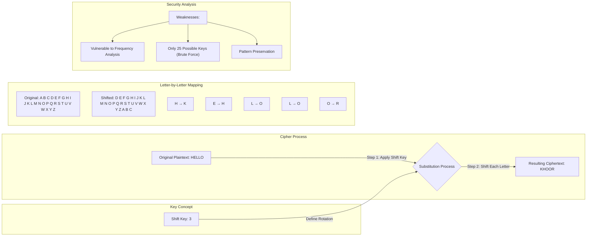

A type of substitution cipher.

It shifts a letter in a [[Plaintext]] by a fixed number of position in the alphabet to produce the [[Ciphertext]]

#Cybersecurity #ProgrammingFundamentals  #TerminologyDefinitions  #ConceptExplanation  #Beginner
