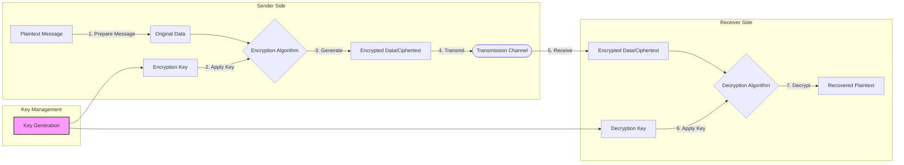

It's a process of making readable data unreadable.

Encryption converts [[Plaintext]] into [[Ciphertext]]

## Encryption process

---

#Cybersecurity #TerminologyDefinitions #ConceptExplanation #Beginner
